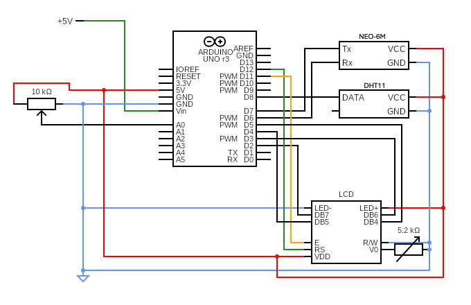

# Waypoint-Unit
A portable Arduino-based environmental monitoring device that measures temperature, humidity, geolocation, altitude, speed, and date in real time.

Currently under development.

## Gallery

### Demo Video

*Left: Potentiometer switching logic*

*Right: Temp, humidity and coords*

### Latest Photo

*Circuit diagram*

## Summary of software:
- Environment: Arduino IDE.
- Language: C++/Arduino.
- Protocols: 9600 baud UART between Arduino <-> DHT11, NEO-6M

## Summary of Hardware:
- Arduino UNO R3.
- Current linkage via USB-B->USB-A.
- Lenovo Thinkpad.
- DHT11 temperature and humidity sensor.
- NEO-6M GPS system.
- Ceramic 24x24 mm antenna.
- breadboard connections.

## Future version milestones:
- Independent power source via AA batteries. (v2.0)
- PCB connected. (v2.0)
- 3D printed casing. (v3.0)

## Features needing development:
- v1.0 has been developed!
- v2.0 coming soon
