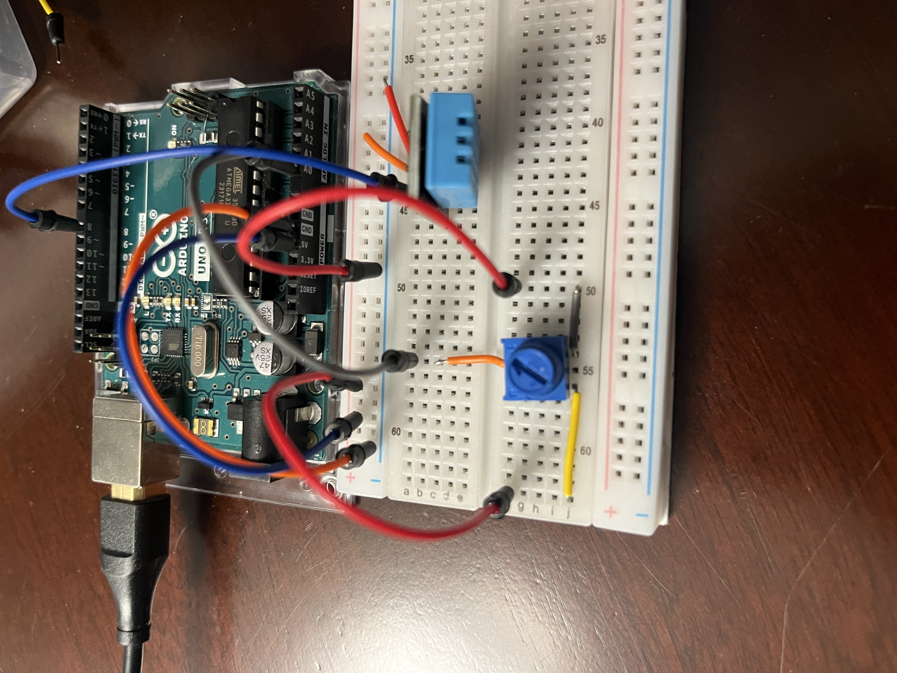

# Waypoint-Unit
A portable Arduino-based environmental monitoring device that measures temperature, pressure, humidity, altitude, and GPS location in real time.

Currently under development.

## Gallery

### Demo Video

*Potentiometer switching logic*

### Latest Photo

*DHT11 sensor implementation*

## Summary of software:
- Environment: Arduino IDE.
- Language: C++/Arduino.

## Summary of Hardware:
- Arduino UNO R3.
- Current linkage via USB-B->USB-A.
- Lenovo Thinkpad.
- breadboard connected.

## Future version milestones:
- Independent power source via AA batteries. (v2.0)
- PCB connected. (v2.0)
- 3D printed casing. (v3.0)

## Features needing development:
- RF detection/transmission
- real-time GPS
- ergonomics